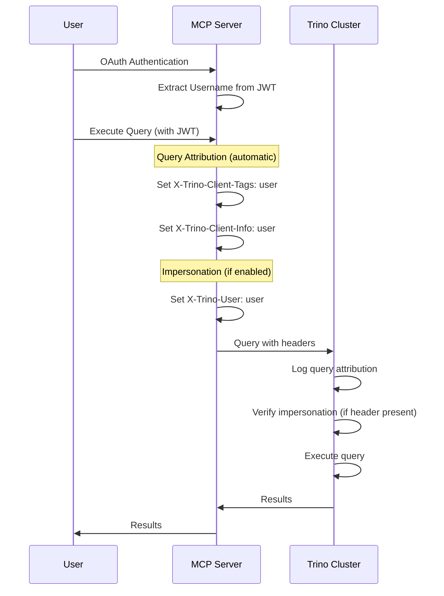

# Trino User Impersonation & Query Attribution

## Overview

mcp-trino provides two complementary features for user identity tracking:

| Feature | Header | Purpose | Requires Config |
|---------|--------|---------|-----------------|
| **User Impersonation** | `X-Trino-User` | Execute queries as the actual user (affects permissions) | `TRINO_ENABLE_IMPERSONATION=true` |
| **Query Attribution** | `X-Trino-Client-Tags`, `X-Trino-Client-Info` | Track who initiated queries (for auditing/monitoring) | OAuth enabled only |

**Key Difference:**
- **Impersonation** changes *who* Trino thinks is running the query (affects access control)
- **Attribution** tags queries with user metadata (for monitoring/auditing without changing permissions)

### User Impersonation

Trino user impersonation allows the MCP server to execute queries on behalf of authenticated users while maintaining a single set of static credentials for the Trino connection. When enabled, MCP executes queries as the actual OAuth user (via the `X-Trino-User` header) rather than the service account.

**Benefits:**
- ✅ **Audit trails** - Queries show actual user names in Trino logs
- ✅ **Access control** - Trino enforces user-specific permissions
- ✅ **Static credentials** - MCP uses one service account for all connections
- ✅ **Security** - OAuth user identity propagated securely via validated JWT tokens

### Query Attribution

Query attribution automatically tags each query with the OAuth user's identity via Trino client metadata headers. This works **independently of impersonation** and is automatically enabled when OAuth is configured.

**Benefits:**
- ✅ **Zero configuration** - Works automatically with OAuth
- ✅ **Non-intrusive** - Doesn't affect Trino permissions or access control
- ✅ **Monitoring** - Track query patterns by user in Trino metrics
- ✅ **Debugging** - Identify which user initiated problematic queries

**Headers set:**
- `X-Trino-Client-Tags` - OAuth username for query tagging
- `X-Trino-Client-Info` - OAuth username for client identification
- `X-Trino-Source` - OAuth username (only if `TRINO_SOURCE` not configured globally)

## Quick Start

### Query Attribution (Automatic)

Query attribution requires **no configuration** beyond enabling OAuth:

```bash
# Just enable OAuth - attribution is automatic
export OAUTH_ENABLED=true
export OAUTH_PROVIDER=okta  # or google, azure, hmac
export OIDC_ISSUER=https://company.okta.com
export OIDC_AUDIENCE=https://mcp-server.com
```

With this setup, all queries from authenticated users will automatically include:
- `X-Trino-Client-Tags: alice@example.com`
- `X-Trino-Client-Info: alice@example.com`

### User Impersonation (Opt-in)

For full impersonation (Trino treats queries as coming from the actual user):

```bash
export TRINO_ENABLE_IMPERSONATION=true

# Optional: Choose which JWT field to use (default: username)
export TRINO_IMPERSONATION_FIELD=email  # Options: username, email, subject
```

### 2. Configure Trino Access Control

Create `/etc/trino/access-control.json`:

```json
{
  "impersonation": [
    {
      "original_user": "mcp_service_account",
      "new_user": ".*",
      "allow": true
    }
  ]
}
```

Create `/etc/trino/access-control.properties`:

```properties
access-control.name=file
access-control.config-file=etc/access-control.json
```

### 3. Restart Services

```bash
# Restart Trino
systemctl restart trino

# Start MCP with impersonation
export OAUTH_ENABLED=true
export TRINO_ENABLE_IMPERSONATION=true
mcp-trino
```

## How It Works

### Combined Flow (Attribution + Impersonation)



### Feature Comparison

| Scenario | Attribution Headers | Impersonation Header | Trino Behavior |
|----------|---------------------|---------------------|----------------|
| OAuth only | ✅ Client-Tags/Info | ❌ None | Runs as service account, tagged with user |
| OAuth + Impersonation | ✅ Client-Tags/Info | ✅ X-Trino-User | Runs as actual user, tagged with user |
| No OAuth | ❌ None | ❌ None | Runs as service account, no user info |

## Configuration

### Query Source Attribution

By default, mcp-trino **always identifies itself** to Trino via the `X-Trino-Source` header as `mcp-trino/<version>`. This enables proper query attribution and monitoring in Trino.

```bash
# Default behavior - automatically set
# X-Trino-Source: mcp-trino/dev (or mcp-trino/1.2.3 in production builds)

# Optional: Customize the source identifier
export TRINO_SOURCE="my-custom-app"
# X-Trino-Source: my-custom-app
```

**Why this matters:**
- Query attribution in Trino logs and metrics
- Identify which application generated queries
- Debug and monitor query patterns by source
- Similar to how DB clients like DBeaver identify themselves

### Principal Field Selection

By default, the `preferred_username` JWT claim is used. You can configure which field to use:

| Field | JWT Claim | Description | Example |
|-------|-----------|-------------|---------|
| `username` | `preferred_username` | Username from identity provider (default) | `alice` |
| `email` | `email` | Email address | `alice@example.com` |
| `subject` | `sub` | Unique subject identifier | `user-123-abc` |

```bash
# Use email (recommended for most cases)
export TRINO_IMPERSONATION_FIELD=email

# Use username (short names)
export TRINO_IMPERSONATION_FIELD=username

# Use subject (stable unique ID)
export TRINO_IMPERSONATION_FIELD=subject
```

**Example:** If your JWT contains:
```json
{
  "sub": "auth0|5f8b3c4d2e1a6c0071234567",
  "email": "alice@example.com",
  "preferred_username": "alice"
}
```

Then:
- `TRINO_IMPERSONATION_FIELD=username` → Trino sees user as `alice`
- `TRINO_IMPERSONATION_FIELD=email` → Trino sees user as `alice@example.com`
- `TRINO_IMPERSONATION_FIELD=subject` → Trino sees user as `auth0|5f8b3c4d2e1a6c0071234567`

### Choosing the Right Field

**Use `email` (recommended):**
- Human-readable in audit logs
- Matches directory services (LDAP/AD)
- Works with most OAuth providers
- Unique and stable

**Use `username`:**
- Short names in logs
- Match Unix/Linux usernames
- Compatibility with existing Trino users
- Note: Some OAuth providers don't include this claim

**Use `subject`:**
- Maximum stability (never changes)
- Works with all providers
- Highest security (unique per user)
- Note: Usually not human-readable

### Provider-Specific Notes

**Okta:**
```json
{
  "sub": "00u1abc2def3ghi4jkl",
  "email": "user@company.com",
  "preferred_username": "user@company.com"
}
```
Recommendation: Use `email` field.

**Google:**
```json
{
  "sub": "108234567890123456789",
  "email": "user@gmail.com"
}
```
Note: No `preferred_username` claim. Use `email` field.

**Azure AD:**
```json
{
  "sub": "AAAAAAAAAAAAAAAAAAAAAMLkPyg-AAAAA",
  "email": "user@company.com",
  "preferred_username": "user@company.com"
}
```
Recommendation: Use `email` field.

## Trino Access Control

### Basic Configuration

Allow the MCP service account to impersonate any user:

```json
{
  "impersonation": [
    {
      "original_user": "mcp_service_account",
      "new_user": ".*",
      "allow": true
    }
  ]
}
```

### Restrictive Configuration

Deny impersonation of admin users:

```json
{
  "impersonation": [
    {
      "original_user": "mcp_service_account",
      "new_user": "admin",
      "allow": false
    },
    {
      "original_user": "mcp_service_account",
      "new_user": "root",
      "allow": false
    },
    {
      "original_user": "mcp_service_account",
      "new_user": ".*",
      "allow": true
    }
  ]
}
```

### User Mapping

Transform usernames before Trino uses them:

**Strip domain from email:**
```json
{
  "user_mapping": [
    {
      "pattern": "(.*)@example\\.com",
      "user": "$1"
    }
  ],
  "impersonation": [
    {
      "original_user": "mcp_service_account",
      "new_user": ".*",
      "allow": true
    }
  ]
}
```
This maps `alice@example.com` → `alice` in Trino.

**Extract username from Auth0 subject:**
```json
{
  "user_mapping": [
    {
      "pattern": "auth0\\|([^|]+)",
      "user": "$1"
    }
  ]
}
```
This maps `auth0|alice-123` → `alice-123` in Trino.

## Complete Setup Example

```bash
# OAuth Configuration
export OAUTH_ENABLED=true
export OAUTH_MODE=native
export OAUTH_PROVIDER=okta
export OIDC_ISSUER=https://company.okta.com
export OIDC_AUDIENCE=https://mcp-server.com

# Trino Configuration
export TRINO_HOST=trino-cluster.example.com
export TRINO_USER=mcp_service_account
export TRINO_PASSWORD=secret
export TRINO_ENABLE_IMPERSONATION=true
export TRINO_IMPERSONATION_FIELD=email

# Start MCP
mcp-trino
```

**Trino access control** (`/etc/trino/access-control.json`):
```json
{
  "catalogs": [
    {
      "user": ".*",
      "catalog": ".*",
      "allow": true
    }
  ],
  "schemas": [
    {
      "user": ".*",
      "catalog": ".*",
      "schema": ".*",
      "owner": true
    }
  ],
  "impersonation": [
    {
      "original_user": "mcp_service_account",
      "new_user": "admin",
      "allow": false
    },
    {
      "original_user": "mcp_service_account",
      "new_user": "root",
      "allow": false
    },
    {
      "original_user": "mcp_service_account",
      "new_user": ".*",
      "allow": true
    }
  ],
  "user_mapping": [
    {
      "pattern": "(.*)@example\\.com",
      "user": "$1"
    }
  ]
}
```

## When to Use Which Feature

### Use Query Attribution Only (OAuth without Impersonation)

Best when:
- You want audit trails without changing Trino permissions
- Service account should handle all access control
- You need to track who initiated queries for monitoring
- Trino access control rules are based on service account, not individual users

```bash
export OAUTH_ENABLED=true
# TRINO_ENABLE_IMPERSONATION=false (default)
```

### Use Full Impersonation

Best when:
- Trino has user-specific access control rules
- Different users need different data access permissions
- Audit logs must show actual user as query executor
- Row-level or column-level security depends on user identity

```bash
export OAUTH_ENABLED=true
export TRINO_ENABLE_IMPERSONATION=true
```

## Verification

### Check MCP Logs

**For Query Attribution (OAuth enabled):**
```
INFO: OAuth 2.1 enabled (mode: native, provider: okta)
```

**For Impersonation (if enabled):**
```
INFO: Trino user impersonation enabled (TRINO_ENABLE_IMPERSONATION=true)
INFO: Impersonation principal field: email
```

### Check Trino Logs

**With Query Attribution only:**
```
# user shows service account, but client_tags shows actual user
user=mcp_service_account client_tags=alice@example.com query=SELECT * FROM table
```

**With Impersonation enabled:**
```
# user shows actual user
user=alice@example.com client_tags=alice@example.com query=SELECT * FROM table
```

### Query Trino System Tables

Check active queries with attribution:
```sql
SELECT
    query_id,
    user,
    source,
    client_tags,
    client_info,
    query
FROM system.runtime.queries
WHERE state = 'RUNNING';
```

## Troubleshooting

### Query Attribution Not Working

**Symptom:** `client_tags` and `client_info` are empty in Trino logs

**Solution:** Verify:
1. OAuth is enabled (`OAUTH_ENABLED=true`)
2. User is authenticated (JWT token is valid)
3. OAuth user has at least one of: `username`, `email`, or `subject` fields

**Note:** Attribution only works when there's an actual OAuth user. If no user is found in context, no attribution headers are added (by design).

### Impersonation Fails

**Error:** "Access Denied: Cannot impersonate user"

**Solution:** Verify:
1. `TRINO_ENABLE_IMPERSONATION=true` is set
2. Trino access control allows service account to impersonate users
3. Target username exists or matches allowed patterns

### User Not Found in Context

**Symptom:** No impersonation or attribution occurs, queries run as service account without user tags

**Solution:** Verify:
1. OAuth is enabled (`OAUTH_ENABLED=true`)
2. JWT tokens are being properly validated
3. The username field is present in JWT claims

### Missing JWT Claim

**Error:** "Missing preferred_username in token"

**Solution:** Your OAuth provider doesn't include this claim. Use `email` or `subject`:
```bash
export TRINO_IMPERSONATION_FIELD=email
```

### Access Denied in Trino

**Error:** "Access Denied: User not found"

**Solution:** The username format doesn't match Trino's expected format. Either:
1. Configure user mapping in Trino (recommended)
2. Change the impersonation field
3. Update Trino user definitions

### Empty Principal

**Error:** No username is extracted

**Solution:** The configured field is not present in the JWT. Check your JWT claims and switch to an available field.

## Security Considerations

1. **Impersonation Rules**: Trino access control must explicitly allow the service account to impersonate users
2. **OAuth Validation**: Only validated OAuth tokens can trigger impersonation
3. **Username Extraction**: Usernames extracted from validated JWT claims only
4. **Header Security**: `X-Trino-User` header only added when impersonation is enabled and user is authenticated
5. **Audit Trail**: All impersonation attempts logged at INFO level

## Implementation Details

### Architecture

The user identity features consist of four main components:

1. **Configuration** - Reads `TRINO_ENABLE_IMPERSONATION`, `TRINO_IMPERSONATION_FIELD`, and `TRINO_SOURCE`
2. **HTTP Round Tripper** - Intercepts HTTP requests to Trino and adds `X-Trino-User` and `X-Trino-Source` headers
3. **MCP Handlers** - Extracts OAuth user and adds to query context for impersonation
4. **Query Attribution** - Adds `X-Trino-Client-Tags/Info` via sql.Named parameters per query

### Request Flow

```
User OAuth Login
    ↓
JWT Token Generated
    ↓
MCP Request (with JWT)
    ↓
OAuth Middleware validates JWT
    ↓
User extracted to context (username/email/subject)
    ↓
┌─────────────────────────────────────────────────────────┐
│ Query Attribution (automatic with OAuth)                │
│   getQueryUsername(ctx) extracts OAuth user             │
│   sql.Named adds X-Trino-Client-Tags/Info headers       │
└─────────────────────────────────────────────────────────┘
    ↓
┌─────────────────────────────────────────────────────────┐
│ Impersonation (if TRINO_ENABLE_IMPERSONATION=true)      │
│   prepareImpersonationContext() adds user to context    │
│   headerRoundTripper adds X-Trino-User header           │
└─────────────────────────────────────────────────────────┘
    ↓
Query executes in Trino
```

### Context Management

User information flows through Go contexts for both features:

```go
// === Query Attribution (automatic) ===
// Trino client extracts OAuth user for attribution headers
func getQueryUsername(ctx context.Context) string {
    user, exists := oauth.GetUserFromContext(ctx)
    if !exists || user == nil {
        return ""  // No attribution if no OAuth user
    }
    // Priority: username > email > subject
    if user.Username != "" { return user.Username }
    if user.Email != "" { return user.Email }
    if user.Subject != "" { return user.Subject }
    return ""
}

// Attribution headers added via sql.Named parameters
if userName := getQueryUsername(ctx); userName != "" {
    queryArgs = append(queryArgs,
        sql.Named("X-Trino-Client-Tags", userName),
        sql.Named("X-Trino-Client-Info", userName),
    )
}

// === User Impersonation (opt-in) ===
// MCP Handler extracts OAuth user for impersonation
user, ok := oauth.GetUserFromContext(ctx)

// Select field based on config (configurable)
var principal string
switch config.ImpersonationField {
case "email":
    principal = user.Email
case "subject":
    principal = user.Subject
default:
    principal = user.Username
}

// Add to Trino context
ctx = trino.WithImpersonatedUser(ctx, principal)

// HTTP round tripper reads from context and adds header
req.Header.Set("X-Trino-User", principal)
```

### Header Priority

| Header | Source | When Set | Configurable Field |
|--------|--------|----------|-------------------|
| `X-Trino-User` | headerRoundTripper | `TRINO_ENABLE_IMPERSONATION=true` | `TRINO_IMPERSONATION_FIELD` |
| `X-Trino-Source` | headerRoundTripper | `TRINO_SOURCE` configured | N/A (static) |
| `X-Trino-Source` | sql.Named | OAuth enabled, `TRINO_SOURCE` empty | Uses OAuth username |
| `X-Trino-Client-Tags` | sql.Named | OAuth enabled | Uses OAuth username |
| `X-Trino-Client-Info` | sql.Named | OAuth enabled | Uses OAuth username |

## Related Documentation

- [OAuth Configuration](oauth.md) - OAuth provider setup
- [Deployment Guide](deployment.md) - Production deployment
- [Trino Access Control](https://trino.io/docs/current/security/file-system-access-control.html) - Trino documentation
- [Trino Impersonation](https://trino.io/docs/current/security/file-system-access-control.html#impersonation-rules) - Impersonation rules
